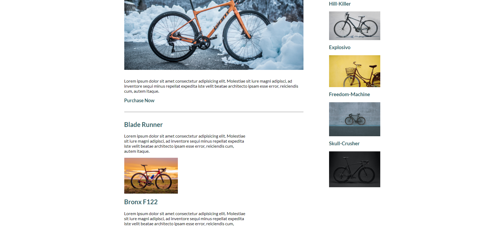

## Bike Warehouse

## Summary

A simple site I created utilizing what I've been learning about flexbox and layouts.

 

 

 

 

 

 

 

The page is responsive with one mobile breakpoint, and will stack content on smaller screens.

 

 

 

 

This is one of several website projects that I've been creating recently to get practice in between portfolio projects to keep sharp with the basics.

**Author**
 
**Robin Fussell** _- Software Developer_ | [LinkedIn](https://www.linkedin.com/in/robin-fussell17/)